# How to use FOS-V3

## First time run

* Download the `FOS-V3` rar file from [Here](https://drive.google.com/drive/folders/11NjBGvJ2UBicPTfqtqxnrJyGfock1sGU?usp=share_link)
* Extract `FOS-V3` in a new folder:
  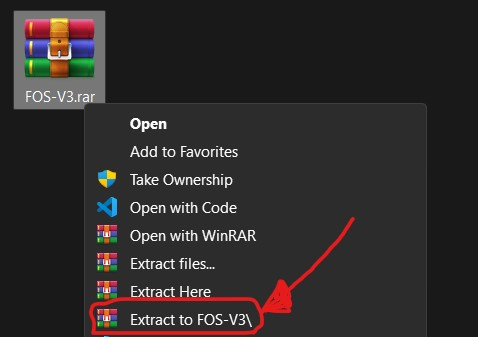
* Run `FOS_VScode.bat`
* VS Code should now open in the project folder
  * Trust project workspace
    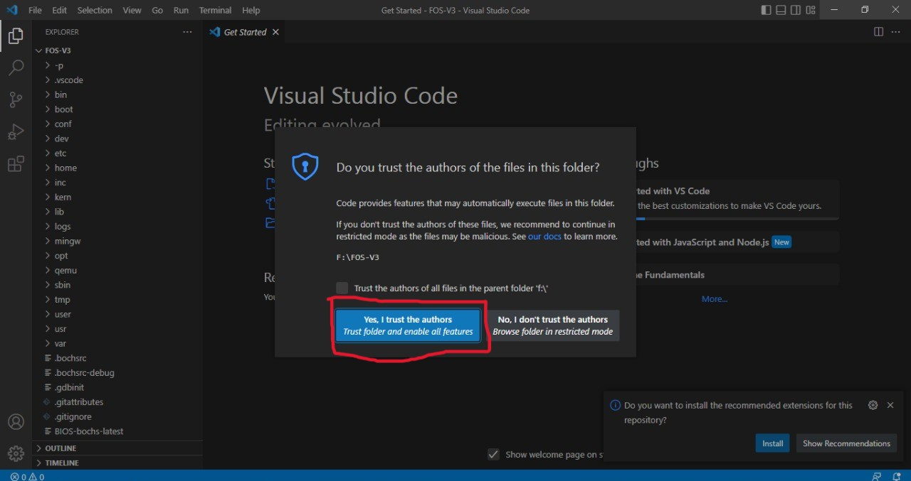
  * You will be automatically notified to download required extensions, Click Yes
    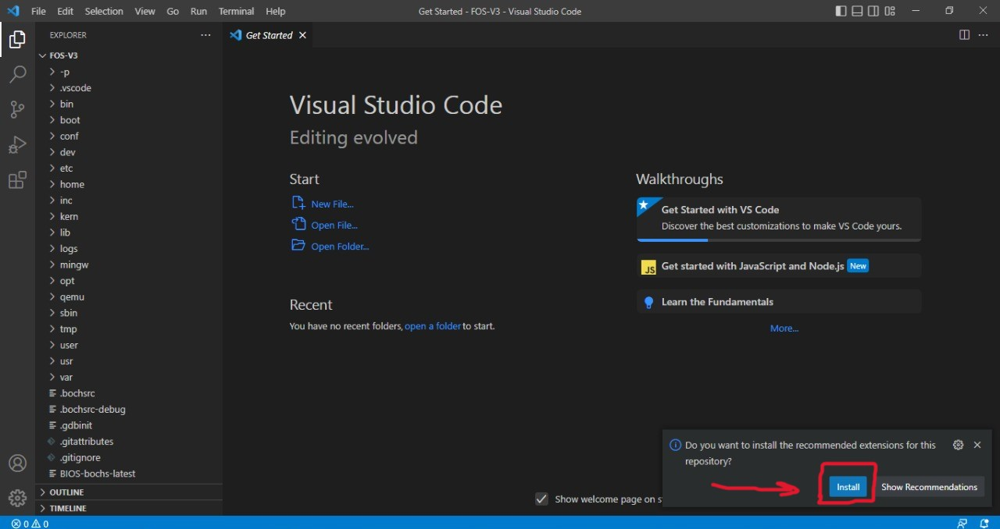

# How to use more than one FOS Template in same environment

## Add a new FOS template

- Put the `FOS_Template` folder you need to run inside `FOS_CODES` as usual
- `FOS_CODES` content should look somthing like this:

  - 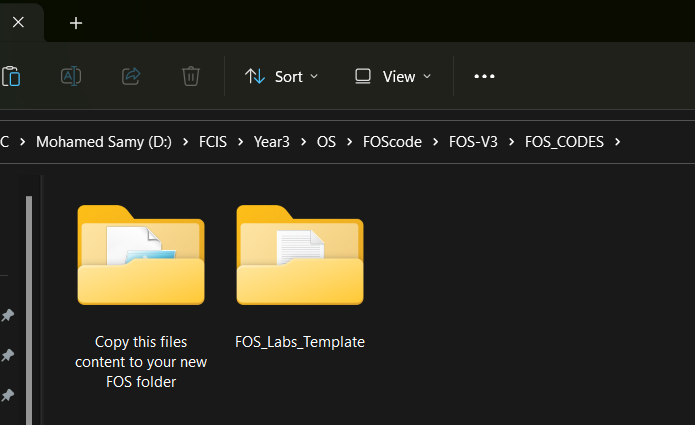
- Inside `FOS_CODES` you will see this folder

  - 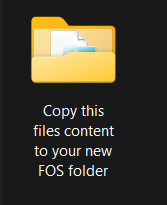
- Copy all contents of `Copy this files content to your new FOS folder` and paste them inside `FOS_Template`

  - 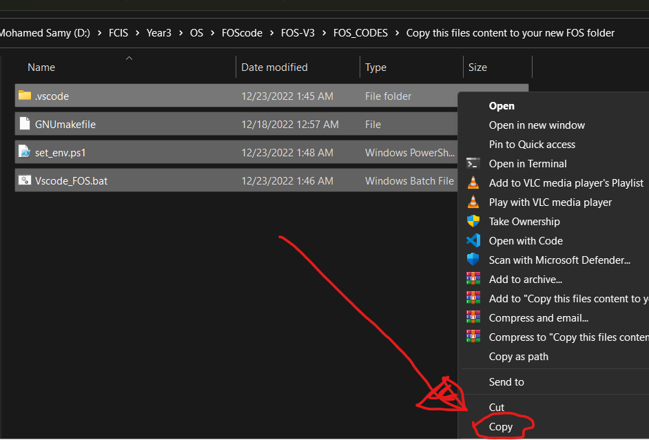
  - 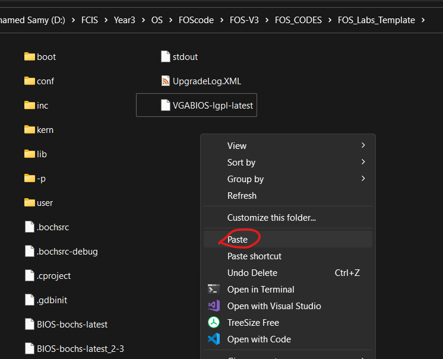
- Accept replace if notified
- Now you can use `Vscode_FOS.bat` to run your project within the same enviroment

## Build and run FOS

* After extenstions install four buttons will appear to build, clean and run FOS on both emulators

  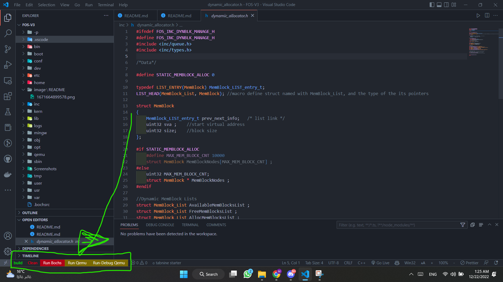
* `Build` just builds the FOS image, but `Run` will also build FOS again every time, also note that build can sometimes fail on the first time after installation or after `Clean` as it creates the required directories
* `Run Bochs` and `Run Qemu` Will build and run FOS in each Emulator respectively use them when your code is modified
* `Run No Rebuild` will instantly run FOS without rebuilding use them for

## Debugging kernel

* If it's the first time to run the debugger, you may see somthing like this (Just click `Allow access` ):
  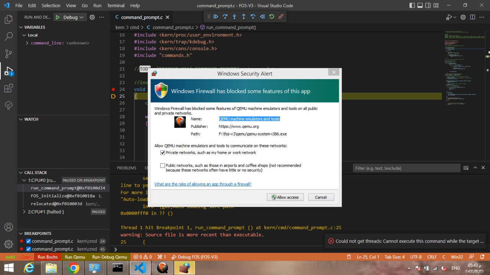
* To debug **Use The Green Button**  on Debug page and make sure that you put all the required breakpoints before you start debugging.
  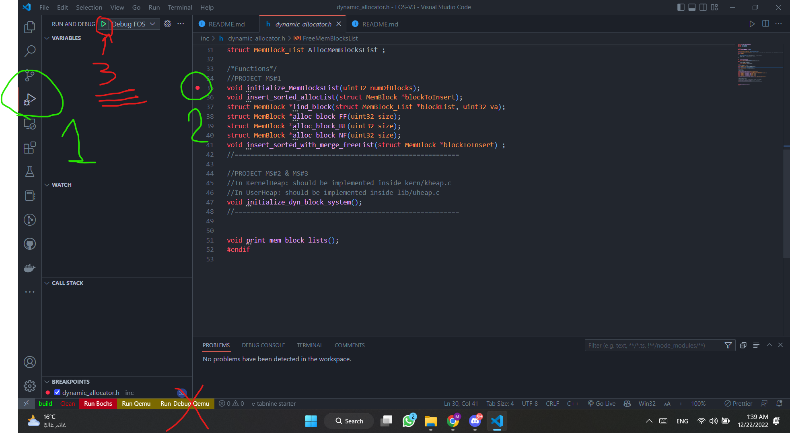

## Debugging user executables

* The default configuration debugs the Kernel binary, to debug a user program go to `.vscode\launch.json`
  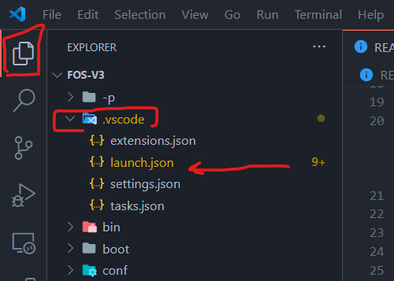
* Create a copy of the current configuration and put it into the configurations array (separated by commas), and set the `name` of your new configuration the change the `executable` path to obj/user/"The name of user program you want to debug", Note: the name of user program binary is usually the same name of the code file but without extension Ex:  `fos_add.c -> fos_add`
  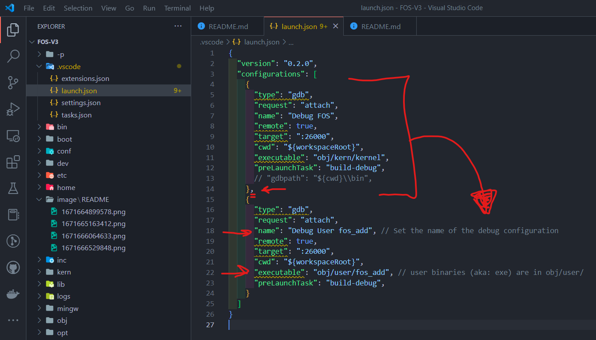
* Now add breakpoints to the user program code and select its debug configuration you just created from the list
  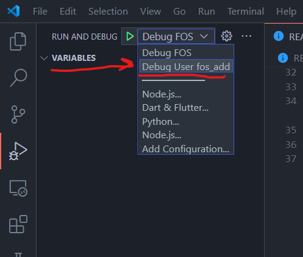
* Click the **Green Button**  and start debugging as usual

## Using TODOs List extenstion

- Click on this side tab

  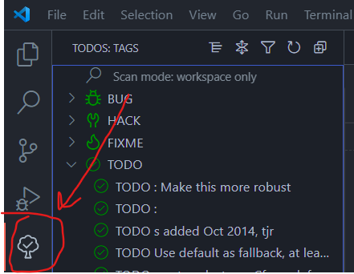
- The Red Button is used to change the view set it to `TAGS` view
- The Green Button is used to group items set it to  `Group by TAGS`
- The Blue Button is used to filter the view and search for specific MS of functions
- 
- Click this button until you get `TAGS` view

  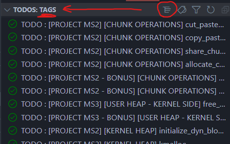
